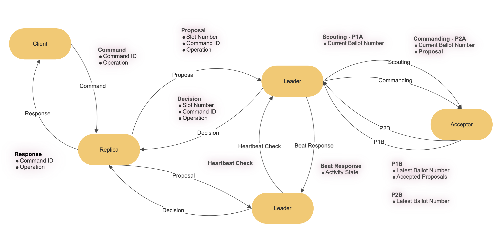

# Implementing multi-paxos with gRPC framework
Another system we built - [ZooKeeper Atomic Broadcast written in Go](https://github.com/Rxu64/gozab)

## System Structure

### Client/main.go
- send operations
- periodically check performed operations
### Replica/main.go
- receive client operations, assign slot number
- send proposal to leaders
- peridoically check decided proposals
- maintain sequencial consistency of how operations are performed
### Leader/main.go
- receive replica proposals, assign ballot number
- send Commanders to ask for acceptor quorum consent
- use Scout to maintain the invariant that only one active leader at a time
- update ballot number when the previous active leader is down
- avoid unstable leadership by sending and receiving hearbeats

## system testing setup and port assginment
- 2 clients (50051, 50052)
- 2 replicas (50053, 50054)
- 2 leaders (50055, 50056)
- 3 acceptors (50057, 50058, 50059)
